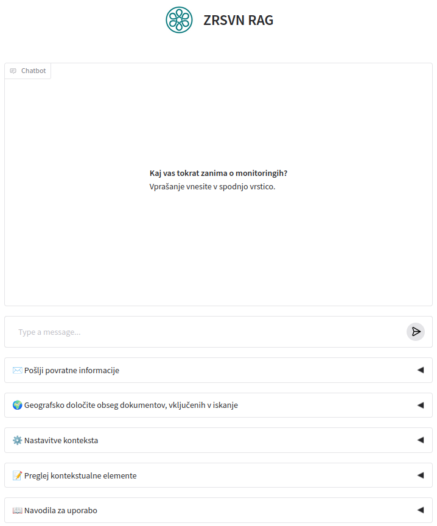
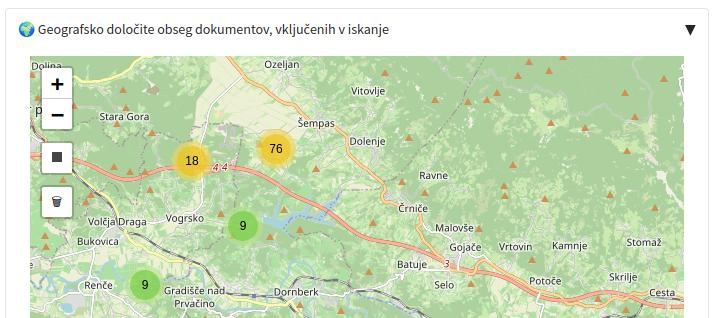
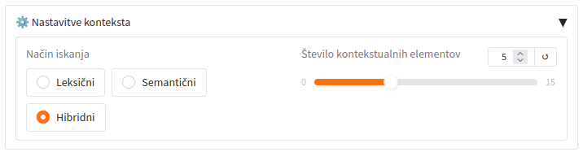
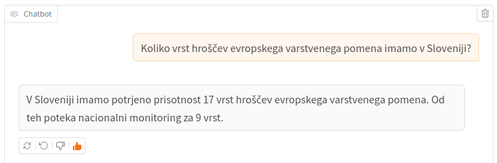
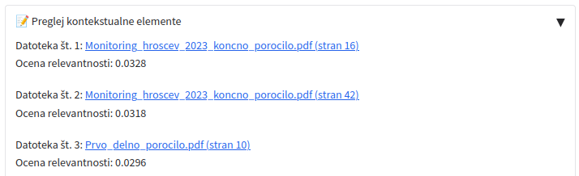
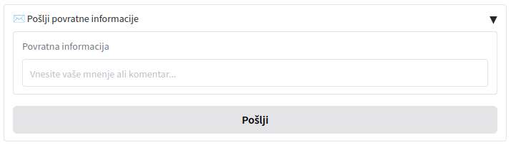

# ZRSVN RAG

Web application with lexical, semantic, and hybrid search capabilities and answer generation based on selected documents.
<br>
<br>



*Overview of the ZRSVN RAG web application interface.*  
*As you can see, most user-facing text was originally written in Slovene, reflecting the principal target users.*

## Features

- Interactive Leaflet map for drawing bounding boxes

<br>

- Three search modes: lexical (BM25), semantic (pgvector), and hybrid (RRF)

<br>

- Conversational interface via Azure OpenAI

<br>

- Generation of presigned URLs for viewing contextual PDF documents

<br>

- User feedback logging

<br>

- Observability via Logfire integration

## Technical requirements

- Python 3.8+ 
- PostgreSQL with the pgvector and ParadeDB extensions
- MinIO/S3 storage for PDF documents 
- Azure OpenAI API access

## Installation

1. Clone the repository:
    ```bash
    git clone https://github.com/gregorgatej/zrsvn-rag.git
    cd zrsvn-rag
    ```

2. Install dependencies:
    ```bash
    pip install -r requirements.txt
    ```

3. Create a `.env` file with the following variables:
    ```env
    POSTGRES_PASSWORD=your_postgres_password
    S3_ACCESS_KEY=your_s3_access_key
    S3_SECRET_ACCESS_KEY=your_s3_secret_key
    ZRSVN_AZURE_OPENAI_ENDPOINT=your_azure_endpoint
    ZRSVN_AZURE_OPENAI_KEY=your_azure_openai_key
    ```

4. Prepare the PostgreSQL database:
- Create the `zrsvn` database with the `rag_najdbe` schema
- Install the `pgvector` and `paradedb` extensions

## Running the application

```bash
python app.py
```